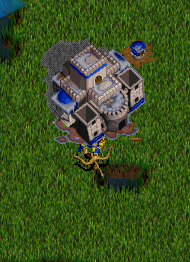
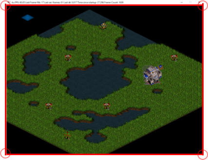
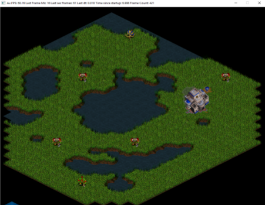
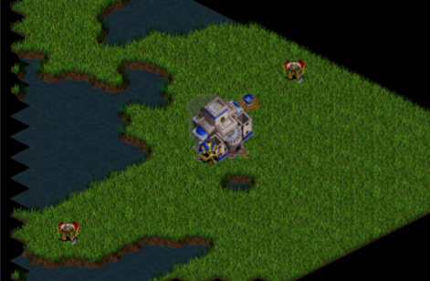
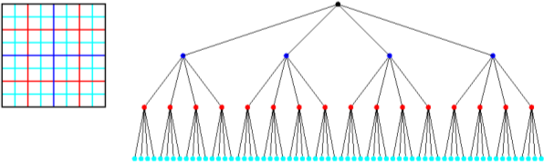

# Sprite Ordering and Camera Culling

My name is [Aleix Gabarró](https://www.linkedin.com/in/aleix-gabarro-70699717b/) and I’m a university videogame developer student from Catalonia in Polytechnic University specifically in [CITM](https://www.citm.upc.edu/). I will explain you my personal research about camera culling and sprite ordering. This is used for the second year in ProjectII, where the students have to create a game under supervision of lecturer [Ricard Pillosu]( https://es.linkedin.com/in/ricardpillosu).
Firstly I will start explain all **camera culling** and continue to **sprite ordering** with their own exercises for a better undersanding.

## Camera culling

The camera culling function is looking for what is on the screen. It's something primary and very important, mostly in a game with a big map and a lot of entities like Warcraft 2. The answer of why is important a good camera culling is simple, we can't Blit(print) all the map and entities each frame because that can mean that the game runs slowly. Camera culling prints only whats is more necessary and would avoid the things that the player won't see, with that you are able to optimize the code and also run the game faster.

## Sprite ordering

Sprite ordering is related with camera culling, and it's used for 2D games because the entities doesn't have a third coordinate to know the depth. The objective of sprite ordering, as the name says, is to put in order the sprites in every frame depending on the position they are located. Without that we could find a situation in which a character or object that is located at the back of another is printed over the second one, like in the next picture:

_What happens without sprite ordering_

It's related with camera culling because the colocation of the sprites it's only revised with the ones that are in the screen and ignoring the other which are not printed. You will see clearly by the time you do it, and next i'm going to explain you how to do it more detailed:

Before we start, in my [repository](https://github.com/aleixgab/SpriteOrdering-CameraCulling) you can find a folder with everything that i'm explaining now and another one with everything done. In the code you can find comments that explain in detail things that can be helpful while doing it and where you have to do it. The libraries that i used are SDL and STD.

## TODOs

We start doing the camera culling 

**TODO 1**: Creates a function that says if tile or object position that we want to print is in the screen

- Use camera rect to compare with the received object rect to see if it's in or not of the screen
- Consider that camera viewport works on the inverse

It's important to use the corners of the screen as a reference for your coordinates

**TODO 2**: Check if the map tile position is on the screen with the function that was created during last TODO

If your function is well done you will see something like this

Camera culling is now applied exclusively for the map and not for the entities, this ones we will do it later.
Now let's start with sprite ordering

**TODO 3**: Create a struct from entities information

The struct hold:
- Rect about the textures (x position, y position, width, heigh)
- Position
- Animation
- Priority (it's a positive whole)

**TODO 4**: Create a priority queue with struct made during last TODO

- Use std::priority_queue
- Third parameter will be done on the next TODO
- The next TODO is related with this one so you can do it together to do it easily

if you have more doubts you can check [here](http://en.cppreference.com/w/cpp/container/priority_queue)

**TODO 5**: Create a struct that compares entities information priorities

          

- We have and strucure so “std::greater” can not be used
- We have to create a new structure and make a bool operation inside

if you have more doubts you can check [here](http://en.cppreference.com/w/cpp/utility/functional/greater)

**TODO 6**: Iterate entities list and push entities information in the priority queue

- Take into account the first TODOs from Camera Culling 
- We only want to push in the queue the ones that are in the screen
- Assign all the entities informations before pushing it to the queue

It's very important to do it in every frame because at the time that you do a pop, the information is lost so you need to pick the position and other information of every single frame and update it in the correct order

**TODO 7**: Pop queue and blit one by one

- Before this, Comment this line “(*iterator)->Draw(texture);" it’s few lines above
- You need to be conscious that depending if there is an animation or not the blit will be different

If you did all TODOs correctly you will see something like this photo:

## Quadtree

Quadtree is a tree that it's splitted up in equal child nodes, is it used for 2D and i will explain it the utility in games. 

With the quadtree we split the screen in four parts, every part become a child part of the original one. If we keep having many collisions, prints or entities we divide one of the child parts and we obtain four more parts that are the childs of the child that we had, and we do it repeatedly.

For example in Warcraft, when the pawns have to bring some materials, they search the ones that have closer or when they chope stone, they look for the closer one that they have in a concrete radius and don't go to the first they have saved that maybe is on the other side of the map.

The quadtree it is useful for the camera culling, because thanks to that you can focus on the node that you want to, and at the same time you would only verify the collisions which are in the same node while ignoring the other ones.

